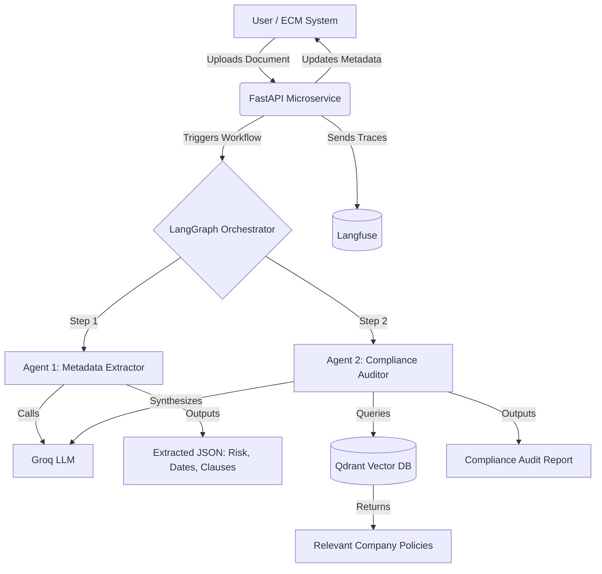

Here’s the **complete Markdown file** you can copy straight into your repo or save locally as `README.md`.  

```markdown
# 🛡️ ContentGuard AI: Enterprise Agentic Document Compliance


**ContentGuard AI** is an enterprise-grade microservice designed to automate legal document compliance, risk analysis, and metadata extraction. Built as an AI "sidecar" for Enterprise Content Management (ECM) systems like Oracle WebCenter, it leverages a **Multi-Agent RAG (Retrieval-Augmented Generation) pipeline** to ensure documents adhere to internal company policies before they are finalized.

---

## 🏗️ System Architecture



---

## ✨ Key Features
- **Multi-Agent RAG Pipeline**: Decouples document parsing from policy auditing using LangGraph for highly reliable, stateful execution.  
- **Enterprise Adapter Pattern**: Backend uses an ECMAdapter interface. Currently running with a LocalMockAdapter for demo purposes, but easily swappable for a real OracleWebCenterAdapter via REST/RIDC.  
- **Automated Evaluation Harness**: Includes a custom "LLM-as-a-Judge" script using Qwen to mathematically score Context Precision and Faithfulness.  
- **Production Observability**: Fully integrated with Langfuse to trace every LLM call, vector retrieval, and latency metric.  
- **Interactive Frontend**: Streamlit dashboard for business users to upload documents and view real-time risk metrics and source citations.  

---

## 🛠️ Tech Stack

| Component        | Technology       | Purpose |
|------------------|-----------------|---------|
| Backend API      | FastAPI         | High-performance, async REST microservice |
| AI Orchestration | LangGraph       | Stateful multi-agent workflow management |
| LLM Provider     | Groq (Llama 3 / Qwen) | Ultra-low latency inference |
| Vector Database  | Qdrant Cloud    | Semantic search for company policies |
| Embeddings       | FastEmbed       | Lightweight embedding generation |
| Frontend UI      | Streamlit       | Interactive dashboard |
| Observability    | Langfuse        | LLM tracing & cost tracking |
| Evaluation       | Custom LLM-Judge| Automated scoring for accuracy |

---

## 🏢 Real-World Enterprise Integration
In production, this microservice acts as an automated workflow trigger for systems like Oracle WebCenter Content (WCC):

1. A legal user checks in a new Vendor Contract to WCC.  
2. WCC fires an `onCheckin` event, triggering the FastAPI endpoint.  
3. The AI downloads the document, extracts metadata, and queries Qdrant for HR/Legal policies.  
4. The AI generates a compliance audit and writes back to WCC, updating metadata fields (e.g., `xComplianceStatus = "Non-Compliant"`) and attaching the audit report.  

---

## 🚀 Getting Started (Local Development)

### Prerequisites
- Python 3.11 or 3.12  
- Accounts for Groq, Qdrant Cloud, and Langfuse  

### Backend Setup
```bash
# Clone the repo
git clone https://github.com/YOUR_USERNAME/contentguard-ai.git
cd contentguard-ai/backend

# Create virtual environment
python -m venv venv
source venv/bin/activate  # On Windows: venv\Scripts\activate

# Install dependencies
pip install -r requirements.txt

# Configure environment variables
# Add GROQ_API_KEY, QDRANT_URL, QDRANT_API_KEY, LANGFUSE keys in .env

# Start the FastAPI server
uvicorn app.main:app --reload
```

Access API docs at: [http://127.0.0.1:8000/docs](http://127.0.0.1:8000/docs)

### Frontend Setup
```bash
streamlit run app.py
```
Access UI at: [http://localhost:8501](http://localhost:8501)

### Run Evaluation Harness
```bash
python run_eval.py
```

---

## 📊 Evaluation Report Card (Sample)

```
======================================================================
🛡️ CONTENTGUARD AI EVALUATION REPORT CARD (LLM-as-a-Judge)
======================================================================

📄 Document: DOC-001 (Missing Liability Clause)
   ➡️ Context Precision: 1.0
   ➡️ Faithfulness:      1.0
   📝 Reasoning: The AI correctly identifies the contract as non-compliant...

📄 Document: DOC-002 (Prohibited Net-90 Terms)
   ➡️ Context Precision: 0.9
   ➡️ Faithfulness:      0.95
   📝 Reasoning: The AI successfully retrieved the finance policy and flagged the terms...
```

---

## 🔮 Future Roadmap
- **Real ECM Integration**: Implement WebCenterAdapter using Oracle RIDC.  
- **Private Cloud LLMs**: Swap Groq for Azure OpenAI or AWS Bedrock.  
- **Human-in-the-Loop (HITL)**: Route “High Risk” documents to human reviewers before finalizing.  

---

## 📜 License
This project is licensed under the MIT License.  
Built by **Pritam Biswas** as an Enterprise AI Portfolio Piece.
```

---

This is the **full file** — you can save it as `README.md` and it’s ready to showcase on GitHub.  

Would you like me to also add a **downloadable link** version (so you can grab the `.md` file directly), or do you prefer to copy-paste this into your repo manually?